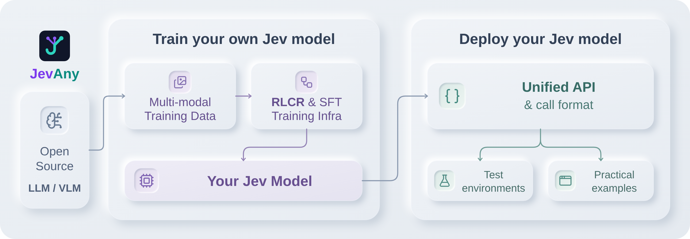
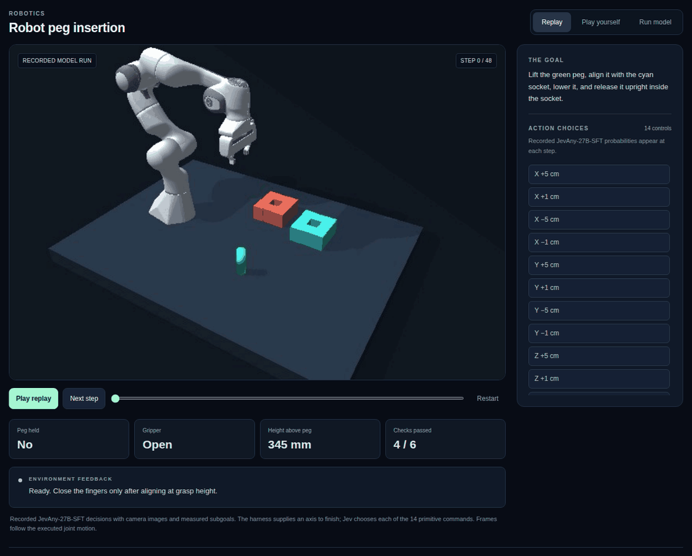
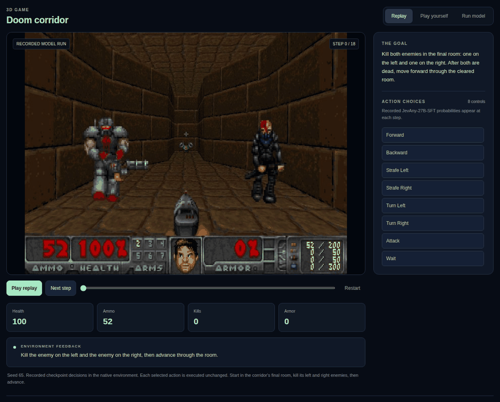
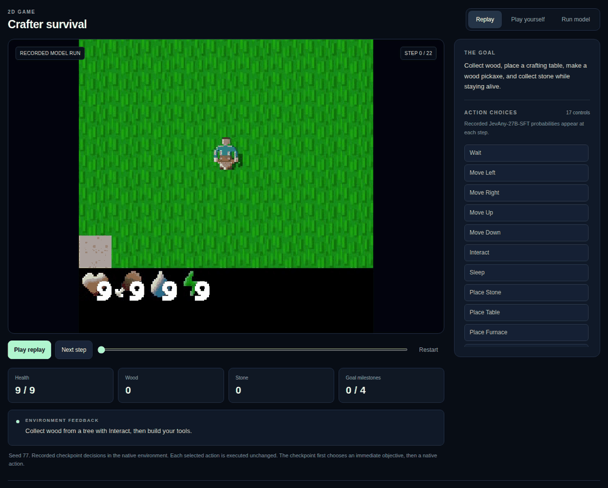
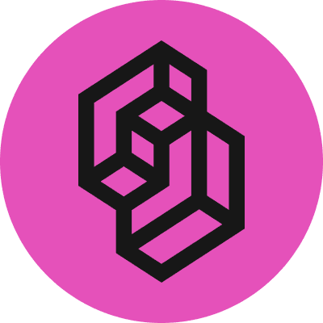

<p align="center">
  
</p>

<p align="center">
  <a href="https://huggingface.co/collections/tianxinwei/jevany-adaptive-decision-systems-6ab2c941bcecb4d2c61d1326"></a>
  <a href="docs/API.md"></a>
  <a href="docs/CASES.md"></a>
  <a href="pyproject.toml"></a>
  <a href="https://github.com/SimpleJev/JevAny/actions"></a>
  <a href="LICENSE"></a>
</p>

<p align="center">
  <strong>English</strong> | <a href="README.zh-CN.md">简体中文</a>
</p>

<p align="center">
  <strong>Train and deploy decision models on open backbones.</strong><br>
  Give JevAny a state, a question and candidate options. Get a choice and its probabilities through one API.
</p>

Use JevAny to route support tickets, select an agent's next tool, or choose a
robot's next action. Start with a released model, then train on your own labelled
examples. The model scores the supplied options without generating answer text.

<p align="center">
  
</p>

[Quickstart](#quickstart) · [Demos](#demos) · [Models](#pretrained-models) · [Results](#evaluation) · [Training](#training) · [Docs](#documentation-and-contributing)

## Demos

These 30 selected successful runs show JevAny choosing actions across robotics,
browser, software, laboratory and mobility tasks. We recorded them with an
earlier compatible checkpoint.

[](docs/CASES.md)

[Explore the cases](docs/CASES.md), or open the playground below to inspect
recorded actions and option probabilities.

## Quickstart

### Try the playground

Use Python 3.12 or newer. Clone the repository and install the lightweight package:

```bash
git clone https://github.com/SimpleJev/JevAny.git
cd JevAny
python3.12 -m venv .venv
source .venv/bin/activate
python -m pip install -e .
jevany demo
```

Open `http://127.0.0.1:8090` and choose **Replay** to watch a recorded run.
The included replays need no GPU, model download or inference server; this
installation does not install PyTorch. Press Ctrl+C in the terminal to stop.

Run the following commands from the repository root with this environment active.

### Route a support ticket

To run a model yourself, install the serving dependencies and start the released
Qwen 4B model. This example uses a CUDA GPU with enough memory for the base model
and runtime; see the [hardware and loading guide](docs/DEPLOYMENT.md#checkpoints-and-hardware).

```bash
python -m pip install -e '.[serve,multimodal]'
jevany serve --checkpoint tianxinwei/JevAny-Qwen3.5-4B-LoRA \
  --device cuda --dtype bf16 --port 8008
```

Keep the server running. In a Python session using the same environment, send a
ticket and the departments that can handle it:

```python
from jevany import Choice, JevClient

jev = JevClient("http://127.0.0.1:8008")
result = jev.system_one(
    state={"ticket": "I was charged twice. Please help."},
    questions={
        "department": Choice(
            instructions="Which team should handle this?",
            criteria={"billing": "Payment problems", "shipping": "Delivery problems"},
        ),
    },
)
answer = result["answers"]["department"]
print("Selected team:", answer["choice"])
print("Probabilities:", answer["probabilities"])
```

`choice` is one of the department names; `probabilities` maps each name to its
probability. Your application can use these fields to route the ticket or ask
for review when the decision is uncertain.

Use `Noul` for yes/no questions, such as whether a ticket needs urgent review,
and `Score` for ordered levels, such as low, normal and high priority.
See the [API reference](docs/API.md) for all three question types, or
[load a model in your Python process](docs/DEPLOYMENT.md#python) to use the same
interface without an HTTP server. Image and video inputs require the
[media setup](docs/DEPLOYMENT.md#native-media-and-limits).

## Examples & Test Environments

The playground includes the three environments below. These GIFs show accelerated
replays from an earlier compatible checkpoint, preserving its actual choices
and original option probabilities.

### [Robot peg insertion](examples/README.md#robot-peg-insertion)

Use a Franka gripper to grasp, align and insert a peg, checked by PyBullet contact physics.



### [Doom corridor · 3D](examples/README.md#doom-corridor-3d)

Clear the final room by defeating the enemies on the left and right, then move
forward. Uses ViZDoom and the included Freedoom assets.



### [Crafter survival · 2D](examples/README.md#crafter-survival-2d)

Gather wood, craft tools and mine stone while managing health and supplies.



### Run your model in the playground

Stop the replay-only playground and keep your model server running. Install the
optional game engines, then restart the playground with the server address:

```bash
python -m pip install -e '.[demo]'
jevany demo --base-url http://127.0.0.1:8008 --text-only
```

Choose **Run model** in the browser, or **Play yourself** to control the game.
Live model runs currently use text state. Robot control needs the separate
`.[robotics]` extra. See the [playground guide](examples/README.md) for platform
requirements and environment APIs, or [integrations](docs/INTEGRATIONS.md) to
combine JevAny decisions with an LLM planner.

## Pretrained Models

| Model | Readout | Intended use |
|---|---|---|
| &nbsp;[JevAny-Gemma-4B-LoRA](https://huggingface.co/tianxinwei/JevAny-Gemma-4B-LoRA) | Pointer | Compact Gemma release |
| &nbsp;[JevAny-Qwen3.5-4B-LoRA](https://huggingface.co/tianxinwei/JevAny-Qwen3.5-4B-LoRA) | Pointer | Compact, flexible choice count |
| &nbsp;[JevAny-Qwen3.5-4B-Direct-Token-LoRA](https://huggingface.co/tianxinwei/JevAny-Qwen3.5-4B-Direct-Token-LoRA) | Direct-token | Best released 4B JevBench accuracy |
| &nbsp;[JevAny-Qwen3.8-27B-LoRA](https://huggingface.co/tianxinwei/JevAny-Qwen3.8-27B-LoRA) | Pointer | Default; highest released accuracy |
| &nbsp;[JevAny-Muse-Glimmer-30B-LoRA](https://huggingface.co/tianxinwei/JevAny-Muse-Glimmer-30B-LoRA) | Pointer | Muse Glimmer alternative |

These are LoRA adapters: the corresponding base model is loaded separately and
its license and access terms apply. Allow roughly twice the base parameter count
in bytes for BF16 weights, plus runtime memory. See the
[hardware and loading guide](docs/DEPLOYMENT.md#checkpoints-and-hardware).

Pointer and direct-token models share the same API. Pointer supports up to
4,096 options within the context limit; direct-token supports up to 255.
See [readout choices](docs/TRAINING.md#pointer-and-direct-token-readouts) for
training and accuracy tradeoffs.

## Evaluation

Qwen3.8 27B has the highest accuracy in this comparison. Among the released 4B
models, direct-token leads on JevBench and pointer leads on Kev Transfer-v9.

| Model | Kev Transfer-v9 ↑ | JevBench ↑ | NLL ↓ | Brier ↓ | ECE ↓ |
|---|---:|---:|---:|---:|---:|
| &nbsp;Kev-4B | 74.19% | 75.32% | 0.858 | 0.380 | 0.125 |
| &nbsp;Kev-27B | 82.31% | 85.28% | 0.533 | 0.265 | 0.050 |
| &nbsp;Jev 1.13.0 | 85.37% | 86.58% | 0.644 | 0.212 | 0.033 |
| &nbsp;Laya | 52.29% | 58.01% | 1.264 | 0.615 | 0.127 |
| **JevAny releases** |  |  |  |  |  |
| &nbsp;Gemma 4B LoRA | 70.84% | 77.49% | 0.706 | 0.369 | 0.056 |
| &nbsp;Qwen3.5 4B LoRA | 78.68% | 80.09% | 0.587 | 0.297 | 0.035 |
| &nbsp;Qwen3.5 4B Direct-Token LoRA | 78.20% | 80.95% | 0.564 | 0.291 | **0.029** |
| &nbsp;Muse Glimmer 30B LoRA | 83.46% | 87.45% | 0.464 | 0.229 | 0.032 |
| &nbsp;**Qwen3.8 27B LoRA** | **85.76%** | **90.48%** | **0.392** | **0.200** | 0.030 |

**Kev Transfer-v9** covers 1,046 scored decisions across classification, question
answering and robustness tasks. **JevBench** covers all 231 public development
items; these are not sealed leaderboard scores. Kev Transfer-v9 also informed model
development, so treat these results as a diagnostic comparison.

NLL, Brier and ECE assess prediction probabilities on Kev Transfer-v9; lower is better.
Kev and Laya results come from complete public-checkpoint runs. Jev combines a
complete Kev Transfer-v9 API run with published JevBench results.

[Full results and protocols](docs/EVALUATION.md#model-family-v2) ·
[Machine-readable results](results/model-family-v2.json) ·
[Method and ablation report](docs/JEVANY_METHOD_AND_ABLATIONS.pdf)

## Training

Train on the same `state` and `questions` you send at inference, with a label
for each question. The bundled synthetic support tickets demonstrate the
workflow; use your own labelled data to train for your application.

The starter recipe uses Qwen3.5-0.8B on CUDA with BF16 and writes `runs/my-jev`:

```bash
python -m pip install -e '.[train]'
jevany data init --out data/starter
jevany data validate data/starter/train.jsonl
jevany train --config recipes/sft.toml --dry-run
jevany train --config recipes/sft.toml
```

After training, try the checkpoint on the included ticket request:

```bash
jevany decide examples/request.json --checkpoint runs/my-jev
```

Pass `--data` to train on your own JSONL, or use
[`recipes/finetune.toml`](recipes/finetune.toml) to adapt the released 27B model.
See the [training guide](docs/TRAINING.md) for CPU settings, multimodal data and
standard `torchrun` launches. For image/video training, install `.[train,multimodal]`.

### Experiment with RLCR

After SFT, you can continue training with rewards for correctness and probability
calibration. RLCR is experimental:

```bash
jevany train --config recipes/rlcr.toml
```

The released family uses LoRA SFT, trained on 1,772,725 text records containing
2,180,242 labelled decisions. Full-parameter SFT and further post-training
improvements are planned.

[Data format](docs/DATA.md) · [RLCR objective](docs/ALGORITHM.md#rlcr) ·
[Training compute and experiments](docs/JEVANY_METHOD_AND_ABLATIONS.pdf)

## Supported Model Families


[Model IDs, supported inputs and setup requirements](docs/TRAINING.md#backbone-support).

## Documentation and Contributing

[Training](docs/TRAINING.md) · [Deployment](docs/DEPLOYMENT.md) · [API](docs/API.md) · [Data](docs/DATA.md) · [Evaluation](docs/EVALUATION.md) · [Contributing](CONTRIBUTING.md)

To contribute a model adapter, evaluation or application example, start with the
[contribution guide](CONTRIBUTING.md). The
[method report](docs/JEVANY_METHOD_AND_ABLATIONS.pdf) and its
[LaTeX source](docs/JEVANY_METHOD_AND_ABLATIONS.tex) describe the model design and experiments.

JevAny is independent of Jev and TypeSafe and includes no Jev weights or private implementation. It includes infrastructure adapted from [Kev](https://github.com/jaredpalmer/kev); see [NOTICE](NOTICE) and [ACKNOWLEDGEMENTS.md](ACKNOWLEDGEMENTS.md). Code and starter data are Apache-2.0. Base models and upstream datasets retain their own terms.
