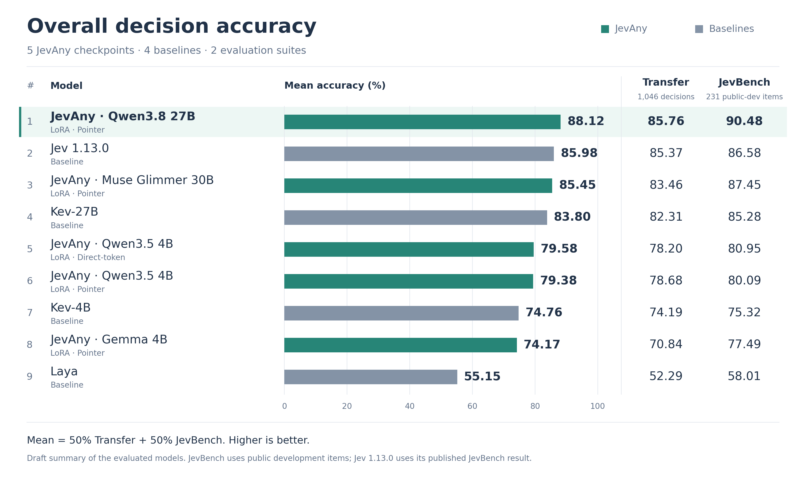

# Evaluation overview draft



Open [the preview](preview.html) for the figure, rationale, and an interactive
comparison of suite weights. The proposed README image is [overview.svg](overview.svg);
[PNG](overview.png) and [PDF](overview.pdf) exports are also available.

The figure ranks every model in [model-family-v2.json](../../../results/model-family-v2.json)
by `50 × (transfer_v9_accuracy + jevbench_public_accuracy)`, using unrounded
source values. Each suite has equal weight; Transfer retains its existing
item-level mean internally. The right-hand columns show the two input accuracies.
All bars start at zero on the same 0–100 scale.

This is a proposed summary metric for these two suites. JevBench covers its
231 public development items. Jev 1.13.0 uses the published JevBench result and
a local API Transfer run. The chart does not establish a general intelligence
ranking or statistical significance. NLL, Brier, and ECE remain separate in
the existing README table.

The 4B readouts illustrate why the weighting needs to be explicit: direct-token
ranks ahead of pointer with equal suite weights; pointer ranks ahead with equal
item weights (`1046 / 1277` Transfer, `231 / 1277` JevBench). Neither difference
should be presented as a robust win without paired uncertainty estimates.

Design references, inspected on 2026-09-30:

- [Artificial Analysis](https://artificialanalysis.ai/): sorted bars, numeric
  labels, separate capability dimensions.
- [LiveBench](https://livebench.ai/): overall scores beside component scores.
- [Arena](https://arena.ai/leaderboard/text): a clear rank, model, score reading
  order. Its uncertainty displays are not reproduced because the release
  aggregate file cannot supply paired confidence intervals.

Suggested placement: after the Evaluation introduction and before the detailed
table. Suggested English caption:

> Mean accuracy on Transfer and JevBench's public development set, with equal
> weight per suite. All five JevAny releases and four baselines are shown.
> See the table below for probability-quality and calibration metrics.

Suggested Chinese caption:

> Transfer 与 JevBench 公开开发集的平均准确率，两套评测各占 50%。
> 图中包含五个 JevAny checkpoint 和四个基线；概率质量与校准指标见下表。

Regenerate from the repository root with matplotlib installed:

```bash
python scripts/plot_evaluation_overview.py
```

Edit `preview.template.html` for preview layout changes; `preview.html` is
generated with the same source data as the static figure. Weight controls affect
only the interactive preview. The PNG, SVG, and PDF retain the 50/50 definition.
